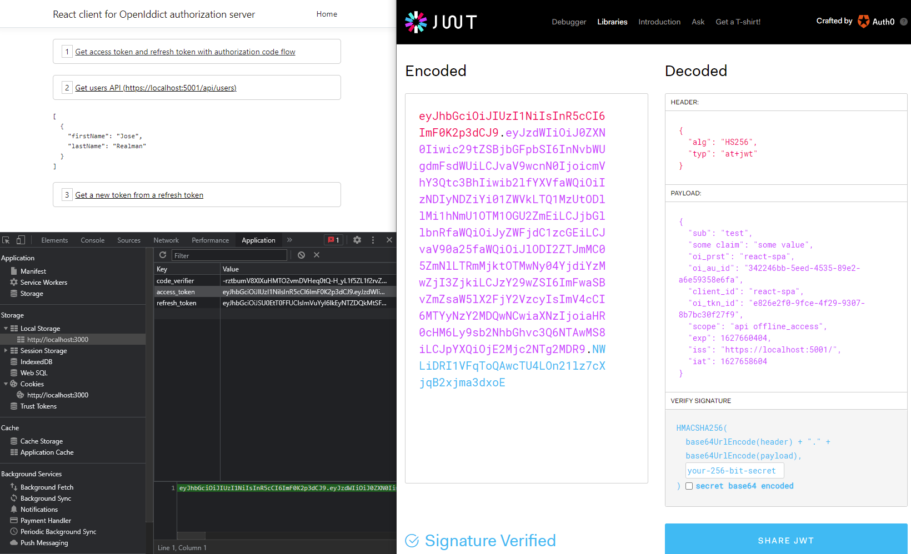

# Codesanook.Examples.DotNetAuthorizationServer

## React Oauth2 client 
- ReactJS client with CRA
- To run the project:
```
$ ./start-client.sh
```
- A browser will be launched and navigate to http://localhost:3000 automatically.

## .NET authorization server
- Oauth2 authorization server with ASP.NET Core MVC .NET 5, [OpenIdcict](https://github.com/openiddict/openiddict-core)
- To run the project:
```
$ ./start-server.sh
```

## screenshot




# Useful endpoints:

- Open ID endpoint: https://localhost:5001/.well-known/openid-configuration

# Reference:
- Authorization server with Open Id Dict series:
  - 1️⃣ https://dev.to/robinvanderknaap/setting-up-an-authorization-server-with-openiddict-part-i-introduction-4jid
  - 2️⃣ https://dev.to/robinvanderknaap/setting-up-an-authorization-server-with-openiddict-part-ii-create-aspnet-project-4949
  - 3️⃣ https://dev.to/robinvanderknaap/setting-up-an-authorization-server-with-openiddict-part-iii-client-credentials-flow-55lp
  - 4️⃣ https://dev.to/robinvanderknaap/setting-up-an-authorization-server-with-openiddict-part-iv-authorization-code-flow-3eh8
  - 5️⃣ https://dev.to/robinvanderknaap/setting-up-an-authorization-server-with-openiddict-part-v-openid-connect-a8j
  - 6️⃣ https://dev.to/robinvanderknaap/setting-up-an-authorization-server-with-openiddict-part-vi-refresh-tokens-5669
  - source code https://github.com/robinvanderknaap/authorization-server-openiddict
- [Call Your API Using the Authorization Code Flow with PKCE - auth0 ](https://auth0.com/docs/flows/call-your-api-using-the-authorization-code-flow-with-pkce#create-code-challenge)
- [OAuth 2.0 and OpenID Connect (in plain English) video](https://www.youtube.com/watch?v=996OiexHze0)
- [JWT Auth in ASP.NET Core article](https://codeburst.io/jwt-auth-in-asp-net-core-148fb72bed03) - [Code](https://github.com/dotnet-labs/JwtAuthDemo)
- [Basic OAuth 2 document in .NET Thailand](https://www.dotnetthailand.com/faq/fundamentals/oauth)
