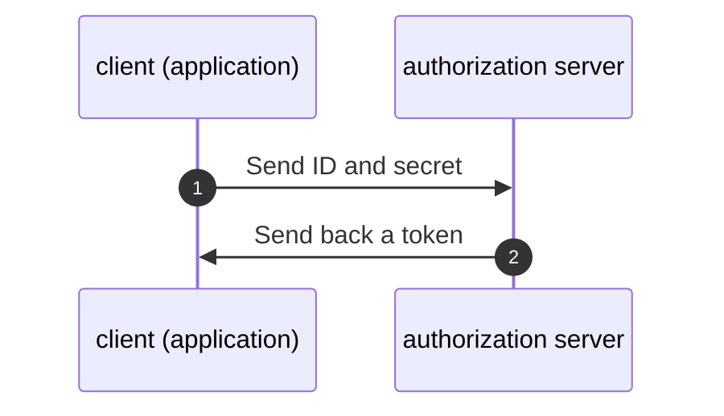
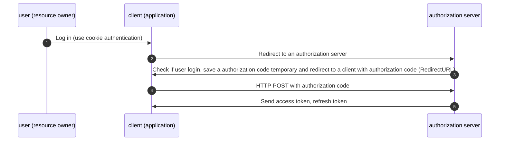
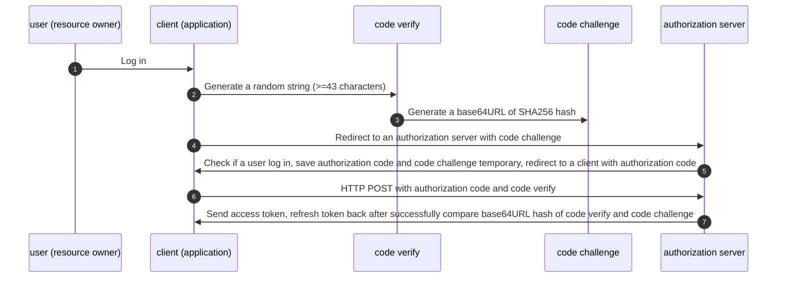

# Node Authorization server example project

### components 
- Resource owner (user)
- Client (application)
- Authorization server
- Resource server

## Assumption
- We have registered user and client on Authorization server database   
- Our system is simple, authorization and resource are on the same machine.

## Client credentials grant type 
- client send client id and secret and get token in response body
- No URL redirect, if someone can steal id and secret, one can get an access token 
- It is okay for server to server

## Authorization code grant type
- This process requires a user to logged before getting an authorization code.

- If someone can steal ID and secret, one can't get an authorization code because it requires a user to log in.  
- However, a hacker can fake a redirect URL and an authorization code 

## Authorization code grant type with PKCE to get access token

### What is PKCE
- Proof Key for Code Exchange
- Usually pronounce 'Pixie'
- A superset feature on top of OAuth2 Authorization Code grant type
- OAuth 2.1 will force to use Authorization code grant type with PKCE.
- A hacker can get an authorization code, code challenge but cannot know a code a code verify. Then one cannot get an access token.  

## Main differences between Authorization code flow with and without PKCE
- Generation of code verify and code challenge
- Include code challenge when redirect a user to authorization server
- Include code verify when exchange token

# To run a project
- Launch a terminal
- yarn run build
- yarn run serve
- Start a new session and run `docker-compose up` to start MongoDB server
- Open a browser and navigate to http://localhost:3000

## URL 
- log in URL for a user http://localhost:3000/auth/login

## Things to concern

## Interesting features
- TypeScript
- ES6 modules

### required packages
- yarn init -y
- yarn add express ejs
- yarn add passport passport-local passport-jwt jsonwebtoken
- yarn add oidc-provider

### Required setup files
- .babelrc
- .editorconfig
- .eslintrc.yml
- webpack.config.js
- tsconfig.json

### Useful links
- Express with TypeScript https://medium.com/the-andela-way/how-to-set-up-an-express-api-using-webpack-and-typescript-69d18c8c4f52
- JWT passport https://medium.com/front-end-weekly/learn-using-jwt-with-passport-authentication-9761539c4314
- Express Route with TypeScript https://dev.to/aryclenio/configuring-routes-in-nodejs-with-typescript-2281
- Passport Local https://github.com/jaredhanson/passport-local
- Get HTTP POST Body in Express.js https://stackabuse.com/get-http-post-body-in-express-js/ 
- cookie JWT https://dev.to/mr_cea/remaining-stateless-jwt-cookies-in-node-js-3lle
- custom authenticate function https://dmitryrogozhny.com/blog/easy-way-to-debug-passport-authentication-in-express
- oauth2orize_client_credentials_example https://github.com/reneweb/oauth2orize_client_credentials_example
- oauth2orize_authorization_grant_example https://github.com/reneweb/oauth2orize_authorization_grant_example
- mongojs https://howtonode.org/node-js-and-mongodb-getting-started-with-mongojs
- Building a RESTful API With Node — OAuth2 Server https://medium.com/@henslejoseph/building-a-restful-api-with-node-oauth2-server-4236c134be4
- check if cookie pass through HTTPS only https://security.stackexchange.com/a/101
- PKCE example https://github.com/Vavassor/Glance-March-2019/blob/master/controllers/oauth2.js
- https://mermaid-js.github.io/mermaid/#/sequenceDiagram
-  OAuth 2.0 กับ Grant Types ทั้ง 6 https://iamgique.medium.com/oauth-2-0-%E0%B8%81%E0%B8%B1%E0%B8%9A-grant-types-%E0%B8%97%E0%B8%B1%E0%B9%89%E0%B8%87-6-e9c82ca978b
- Should we add role in JWT https://stackoverflow.com/a/53527119/1872200

### TODO
- logging system
- indexing Mongo DB
