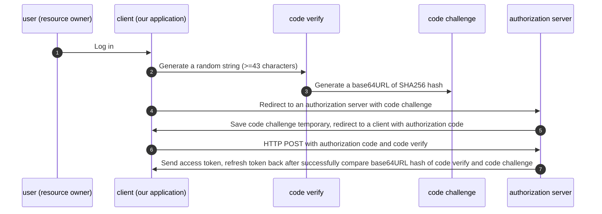

## Interesting features
- TypeScript
- ES6 modules

### required packages
- yarn init -y
- yarn add express ejs
- yarn add passport passport-local passport-jwt jsonwebtoken
- yarn add oidc-provider

### Required setup files
- .babelrc
- .editorconfig
- .eslintrc.yml
- webpack.config.js
- tsconfig.json

### To run a project
- yarn run build
- yarn run serve
- Open a browser and navigate to http://localhost:3000

### URL 
- login http://localhost:3000/auth/login

### Useful links
- Express with TypeScript https://medium.com/the-andela-way/how-to-set-up-an-express-api-using-webpack-and-typescript-69d18c8c4f52
- JWT passport https://medium.com/front-end-weekly/learn-using-jwt-with-passport-authentication-9761539c4314
- Express Route with TypeScript https://dev.to/aryclenio/configuring-routes-in-nodejs-with-typescript-2281
- Passport Local https://github.com/jaredhanson/passport-local
- Get HTTP POST Body in Express.js https://stackabuse.com/get-http-post-body-in-express-js/ 
- cookie JWT https://dev.to/mr_cea/remaining-stateless-jwt-cookies-in-node-js-3lle
- custom authenticate function https://dmitryrogozhny.com/blog/easy-way-to-debug-passport-authentication-in-express
- oauth2orize_client_credentials_example https://github.com/reneweb/oauth2orize_client_credentials_example
- oauth2orize_authorization_grant_example https://github.com/reneweb/oauth2orize_authorization_grant_example
- mongojs https://howtonode.org/node-js-and-mongodb-getting-started-with-mongojs
- Building a RESTful API With Node — OAuth2 Server https://medium.com/@henslejoseph/building-a-restful-api-with-node-oauth2-server-4236c134be4
- check if cookie pass through HTTPS only https://security.stackexchange.com/a/101
- PKCE example https://github.com/Vavassor/Glance-March-2019/blob/master/controllers/oauth2.js
- https://mermaid-js.github.io/mermaid/#/sequenceDiagram

### TODO
- logging system
- indexing Mongo DB

## Authorization code grant type with PKCE to get access token

### What is PKCE
- Proof Key for Code Exchange
- Usually pronounce 'Pixie'
- A superset feature on top of OAuth2 Authorization Code grant type
- OAuth 2.1 will force to use Authorization code grant type with PKCE.

## Main differences between Authorization code flow with and without PKCE
- Generation of code verify and code challenge
- Include code challenge when redirect a user to authorization server
- Include code verify when exchange token

